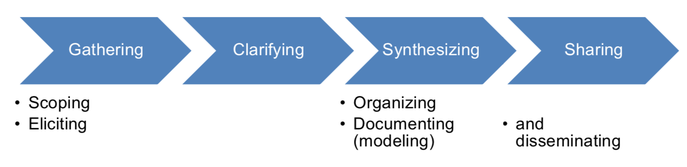
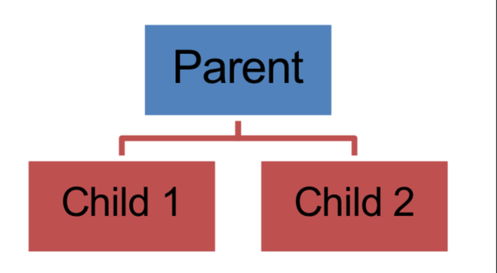
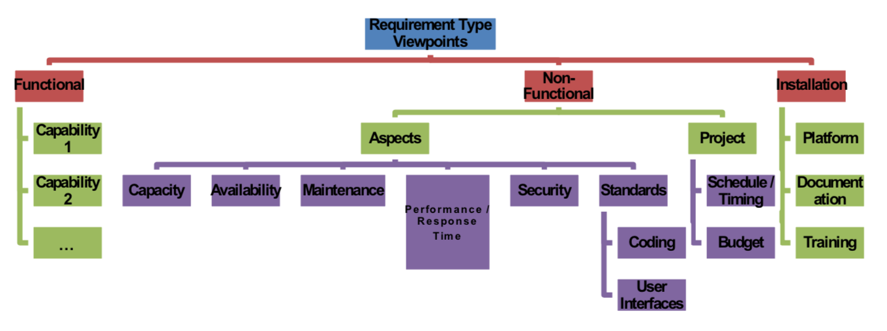
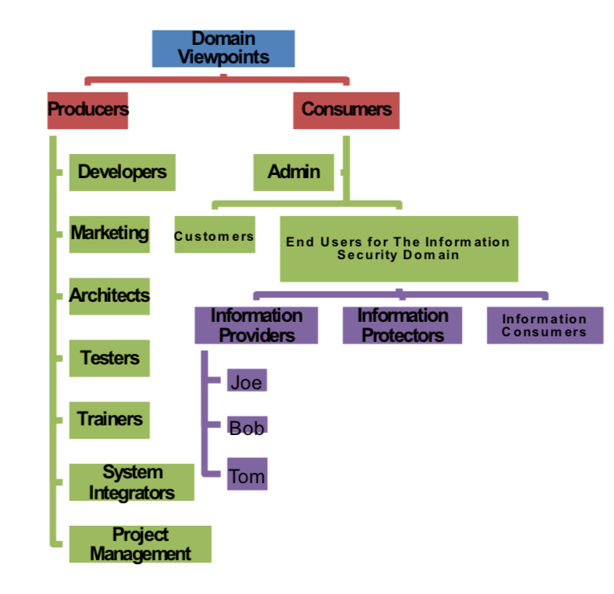
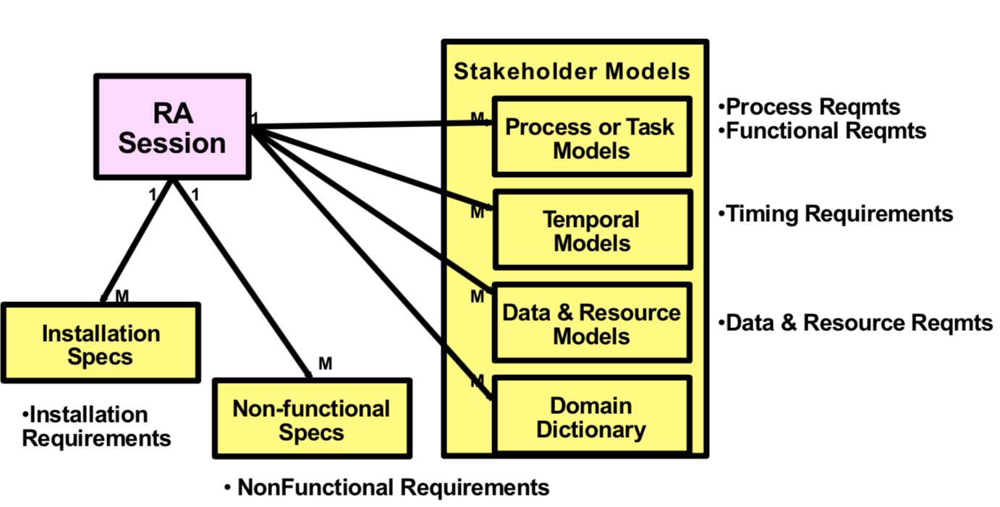
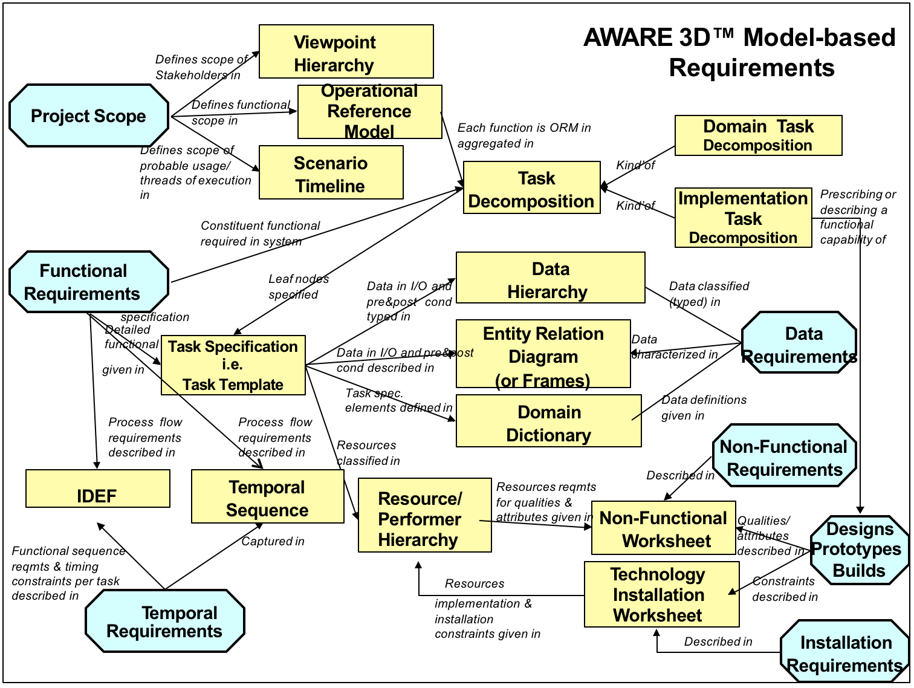
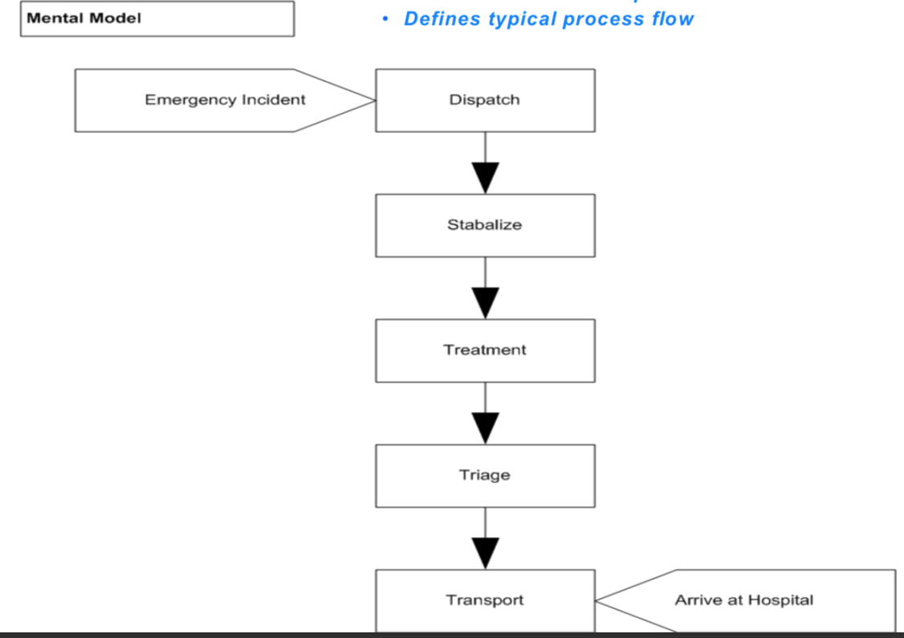
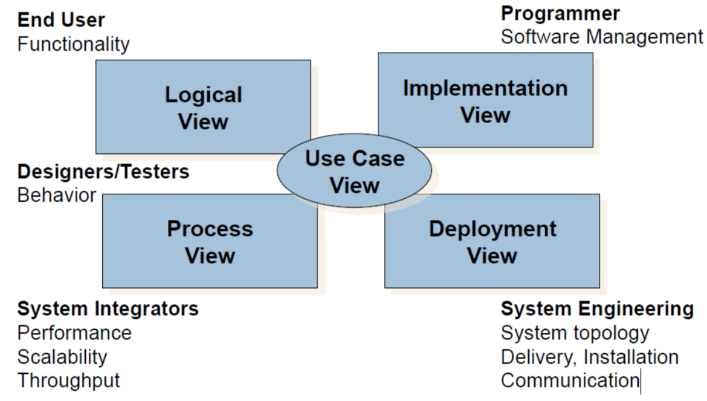
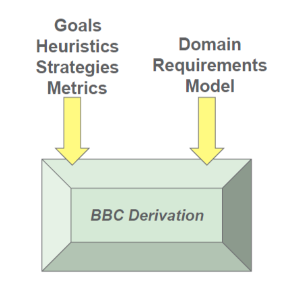
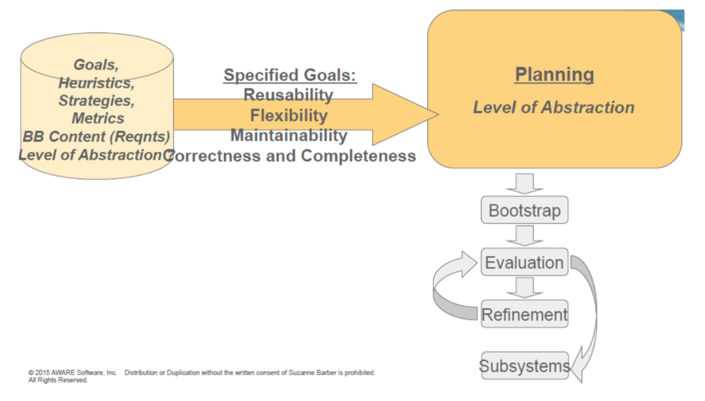

# Final review

## Overview

- Requirement engineering (type, interview, model, synthesis) 
- Software architecture (type, specification, derivation, deployment) 
- Version control (svn, git) 
- Build management (ant, maven) 
- Software testing (program analysis, program repair, fault localization, some cutting-edge topics) 

## Requirement engineering 

* The challenge -> Call to action -> The goal state
* Requirements Management is a process of Systematically 
  * scoping 
  * editing
  * organizing
  * documenting and disseminating 

### Risks

- Typical risks are related to uncontrolled, mismatching expectations.
- The risk of developing in a vacuum without continued stakeholder input.
- The risk of not stating the “obvious.” 
- The risk of customer expectations not matching the planned delivery. 
- The risk of “necessary” constant change or constant change due to constant modification because agreement between stakeholders is never achieved.
- The lack of stakeholder ownership, developer time consider plentiful, false sense of time luxury
- Rapid development requirements risks 
- Failure to recognize that faulty requirements represent risks.
- This risk of poor or non-existing documentation 

### Requirements 

- A requirement is a capability the system must deliver or constraint the system must satisfy 
- A feature is a service the system provides to fulfill one or more stakeholder needs. 
  - Associated with system design
- The Requirements Risks should be understood and avoided.

#### Business Requirements 

* Also called Functional Requirements 
* Business Requirements govern the system behavior
  * business process functionality, data and  data relations, timing between functions
* Business I/O Requirements 
  * Data I/O 
  * Event I/O
* Business timing requirements 
  * Duration
  * Frequency
  * Pre- and Post- Conditions 

#### Non-functional Requirements 

* describing a specific quality of the system (e.g., Reusability, Maintainability, Scalability) 
* describing characteristics based on system execution (e.g., performance, look-and-feel) 
* constraining product lifecycle (e.g., cost, schedule) 

#### Installation Requirements 

* describing the infrastructure governing the deployment of the system 

### Interview 

#### Introduction

* Sets the mood and direction of the session 
* Rapport
* Remind stakeholder of the project/product mission, session goals and targeted requirements outcomes

#### Body

* Ask questions and acquire information to meet the Session Goals and obtain the Targeted Outcomes
* The Funnel, or inverse
  * Broad, open questions
  * Probing questions
  * Restrictive questions 

#### Closing 

* Intend to set limits on the type, level, and among of information to be provided by a stakeholder 

#### Other Concepts

* Analysis strategies should becustomized basedon thetypesof requirementsto be acquired
* Process Tracing reveals problem solving strategies
* Task Analysis uncovers the different layers of granularity (details) of required system functionality
* Detailed Task Analysis seeks to gain informationabout oneparticulartask
* The information to be acquired during a Detailed Task Analysis along with possible questions to ask to acquire specific Task Details

### Model

#### Gathering

* RE challenges are to undercover the interests that make projects successs or failures 
* Requirement methodologies must be equipped to identify the range of the stakeholders 
* Requirement methodologies must gather and represent different stakeholder interests

#### Clarifying

* Document the conversation  
* Use the Session Notes template or similar vehicle
* Be precise in recounting what you heard
* Identify gaps, inconsistencies, or contradictions 
* List any clarifying questions 

#### Synthesizing

##### Organizing

* Bring together like requirements into viewpoints

  * Identify common threads 
  * Recognize competing requirements 
  * Detect missing requirements

*  Possible Dimensions

  * Functional / Non-Functional / Installation
  * Stakeholder Type / Application Domains
  * Organizational Structure 
  * System Structure
  * Level of Detail 

* View point hierarchies

  * Modeled as hierarchies

    * A “parent” of entities in a viewpoint hierarchy represent common requirements among those entities 
    * “Children” of an entity in a viewpoint hierarchy represent differentiation of requirements 

  * Viewpoints are a means to: 

    - Organize for a respective 

      stakeholder 

    - Organize for a respective type of viewpoint 

    - Identify conflicts and commonalities among various viewpoints

  

* Requirement type 

  

* Stakeholder Type / Application Domains

##### Combining

* Collapse identical requirements
* Add Inferred requirements (marked appropriately)
* Identify questions or gaps 

#### Sharing

* Establish change control on Documented Project Requirements 
* Establish protocol for gathering comments / objections 
* Distribute documents to all Stakeholders with deadline for response 
  - Positive response required – Stakeholder must reply 
  - Negative response – no reply by deadline implies consent
  - Gather and disposition responses
* Update documents – using change control to identify changes 
* Repeat until consensus / approval attained 
  * Project protocol may allow select activities to proceed with less than complete approval

#### Stakeholder

- Stakeholders include anyone with an interest in, or an effect on, the outcome of the product, not affected by the product
- Consistency
  - Core team member
    - product designers, developers, system architects, technical writers, system analysts, testers
  - Operational work area
    - operational support, maintence operator 
  - Containing business
    - Internal consultant, sponsor, functonal beneficiary, owner
  - Wider environment
    - negative stakeholder, external consultant, political beneficiary, customer
- End users: discover features(functional requirements); purchasers, discover constraints

### Vision Doc

* Vision Document serves as a Project Foundation
  * Role of the document in the software process 
  * Provides a means for stakeholder communication and agreement

#### Structure

1. Introduction
   * Purpose
   * Product overview
   * References

2. User Description
   * User/Market Demographics 
   * User Profiles  
   * User Environment 
   * Key User Needs
   * Alternatives and Competition  

3. Product Overview
   * Product Perspective  
   * Product Position Statement  
   * Summary of Capabilities  
   * Assumptions and Dependencies 
   * Cost and Pricing 
4. Feature Attributes
   * Status 
   * Priority 
   * Effort 
   * Risk 
   * Stability 
   * Target release 
   * Assigned to 
5. Product Features
6. Key use cases
   * A Use Case is 􏰆a sequence of actions a system performs that yields a result of value to a particular actor
   * Diagram
   * Brief Description
   * References
   * Preconditions
   * Normal Flow of Events
   * Alternative Flows 
7. Other Product Requirements
   * Applicable Standards
   * System Requirements
   * Licensing Installation
   * Performance Requirements 
8. Documentation Requirements
   * User Manual
   * Online Help
   * Installation Guide, Configuration, and Read-Me Files
   * Labeling and Packaging

#### Software Requirements Specification (SRS)

* Overview 
* Revision History 
* Table of Contents 

1. Introduction 
2. Use-Case Model Survey
3. Actor Survey
4. Requirements
5. Online User Document and Help System Requirements 
6. Design Constraints 

7. Purchased Components
8. Interfaces
9. Licensing Requirements
10. Legal, copyright and other notices 
11. Applicable Standards 

* Index
* Glossary

### Requirements Acquisition

* Modeling concept

  * Inheritance, Aggregation, Abstraction

* Functional Analysis aimed at acquiring the scopeand execution of system functionality

* Process Analysis aims at understanding threads of execution for the target system. 

* Operational Reference Model 

  

* Scenario Timeline represent a good way to key scenarios. 

* Task Analysis aims to describe the breadth, granularity and details of system capabilities (functionality). 

  * Acquisition Purpose 

    - Understandthedecompositionofhighleveltasks(identifiedinthescenario) 

      into constituent subtasks 

    - Under stand the classifications of tasks 

    - Under stand the completedetails of respective tasks

  * Modeling Output 

    * Task Decompositions 

    * Task Hierarchies (task classifications)

    * TaskTemplates 

* Task Decomposition describes the constituent subtasks required to accomplish a particular tasks

  * Tasks are decomposed into their respective subtasks
  * Challenge: insuring the appropriate level of abstraction both in terms of the breath of tasks and the layers (level or granularity) of decomposition 
  * Domain Task Decomposition describe the aggregation of implementation-independent tasks. 

* Temporal Analysis describe the Functional Timing and order (sequence) of a process to be executed by the system

* Temporal Sequence Diagram

* IDEF Diagram of a Task(ina Process) is a compact representation of the Task Template, describe the process sequenceof task execution. 

### Summary

* Different stakerholders drive different types of requirements 
* RE challenges are to undercover the interests that make projects successs or failures 
  * requirement methodologies must be equipped to identify the range of the stakeholders 
  * requirement methodologies must gather and represent different stakeholder interests to include 
* Viewpoints capture the perspective of a stakeholder, are modeled in hierarchies
  * Domain viewpoint = perspective based on role played in the application domain 
  * Organizational viewpoint = perspective based position in a respective organization

## Software architecture 

* A program or computing system is the structure or structures of the system, which comprise software elements, the externally visible properties of those elements, and the relationships among them
  * architecture defines elements 
  * systems can and do comprise more than one structure
  * every software system has an architecture 
  * behavior of each element is part of the architecture 
* Involves
  * The description of elements from which systems are built
  * interactions amongst those elements
  * patterns that guide their composition
  * and constraints on those patterns 

### Concepts

- Box and Line 
- Data Structures and relationships 
- Reflection of the system intent 
- System flowchart – data flow or control flow 
- Hardware and software decisions or selections for the system 
- Hardware and software required (constrained to use) 
- System vision – requirements, lifetime, stakeholders 
- Use cases 
- Feasibility -- evaluations 

### 4+1 Architecture Views 

* Logical View 
  - Functionality of the system 
  - Abstraction of design model represents the logical structure of the system in terms of subsystems and classes (􏰀deliverers􏰁 of functionality) 
* Implementation View 
  - System description relevant to implementation: (for software, that is source code, libraries, object classes, etc.) 
  - Static View of implementation pieces, not how each interacts. 
* Process View 
  - Describes operations of the system (extremely important for systems with parallel tasks, interfaces with other systems, multi-threading). 
  - View helps to identify problems such as race conditions or deadlock, throughput and performance issues. 
* Deployment View 
  - Allocation of the Implementation View to the Supporting Infrastructure (e.g. OS, computing platforms). 
  - Not concerned with What interaction are but rather concerned with the existence of interactions and constraints when two systems meet
* Use Cases
  - Describe the intended system behavior as opposed to understanding the behavior of the business the system will operate within. 
  - Describe the System's behavior from the perspective of how the various users interact with the system to accomplish their objectives. 
  - Describes a sequences of actions a system performs that yields a result of value to a particular actor. 
  - Use Case Model includes all Actors of the system and all Use Cases by which Actors interact with the system

### Business Blueprint Specifications 

* A modular, technology independent view represented as related business components intended for reuse in building a 􏰀family􏰁 of applications. 

* Each Business Component should uniquely own service(s) and data 

  - Business Component services = business tasks (capabilities) = functional 

    requirements 

  - Business Component attributes = business data = data requirements 

* Tasks and data in Business (domain) Model assigned to respective Business Components 

#### Motivation

- software systems continue to grow in size and complexity 
- software systems must meet stakeholders requirements 
- stakeholder requirements change 
- while reuse is embraced, few applications can be reused with zero modifications 

#### Aim

- Provide a 􏰀blueprint􏰁 for developing a family of solutions in a domain 
- Capture business (functional, data, and timing) requirements 
- Serve as an Implementation Independent view of the system 
- Expresses an architect's vision

#### Declarative Model 

*  Component Specification Template
  * Name 
  * Classification
  * Attributes Required/Provided
  * Services Required/Provided 

#### Behavioral Model 

* BB Behavioral Model describes the states of the BBC and the transitions (conditions) to move from one state to another 

#### Integration Model 

* Set of constraints and dependencies between components. 

### BB Derivation

#### Goal

* Reusability
* Extensibility and Maintainability
* Comprehensibility 
* Ease of Implementation 

#### Domain Requirements Models 

* Functional Requirements 
  - Task Decomposition (and sometimes Task Hierarchy) 
  - Task Template 
    - Data Requirements per task 
    - Performance Requirements per task 
    - Usage Profile
* Data Requirements 
  - Data Hierarchy 
  - Data Entity Relation Diagram -- Relationships between data concepts referenced by tasks, where 􏰀relations􏰁 include hierarchies, compositions, and domain-specific associations 
* Performance Requirements 
  * Performer (Resource) Hierarchy -- Hierarchical relationships between performers, based on role, job, capability, etc. 

### Deployment (BB Derivation Process) 

#### Specified Goals + Planning

* Reusability Goal
  * Derivation Plan 
    * Reduce coupling between technologies, thereby reducing entanglements and facilitating reusability 
  * Measurement Plan 
    * Coupling Metric: Num Input/Output between BBCs 
* Flexibility Goal
  * Derivation Plan 
    * Reduce number of services per technology to increase the number of possible technology combinations 
  * Measurement Plan 
    - Size/Complexity Metric: Num Services, Attributes in BBC 
* Maintainability Goal
  * Derivation Plan 
    * Reduce number of services per technology to simplify technology complexity 
    * Reduce number of attributes per technology to simplify technology complexity 
    * Reduce coupling between technologies, thereby reducing interface complexity 
  * Measurement Plan 
    * Size/Complexity Metric: Num Services, Attributes in BBC 
    * Coupling Metric: Num Input/Output between BBCs 
* Completeness and Consistency Goal 
  * Derivation Plan 
    * All necessary tasks, data, and events should be represented in the BB
    * A given task, data, or event should be provided by one and only on BBC 
  * Measurement Plan 
    * Size/Complexity Metric: Num missing Services, Attributes in BBC
    * Coupling Metric: Num Duplicate Services 

#### Boostrapping 

* Delete duplicate services
* Delete duplicate attribute
* Detect missing attribute

#### Evalution

* Goal specific metric based

#### Refinement

* Reusability Refinement

  * Evaluate the BB w.r.t. 􏰀Coupling,􏰁 which impacts Reusability
  * Refine the BB to improve 􏰀Coupling􏰁
  * Re-evaluate the refined BB w.r.t. 􏰀Coupling􏰁 

* Flexibility Refinement 

  * Evaluate the BB w.r.t. 􏰀Num Services in BBC,􏰁 which impacts  Flexibility
  * Refine the BB to reduce 􏰀Num Services in BBC􏰁
  * Re-evaluate the refined BB w.r.t. 􏰀Num Services in BBC􏰁

* Maintainability Refinement 

  * Evaluate the BB w.r.t. 􏰀Num Services in BBC,􏰁 which impacts 

    Maintainability 

  * Refine the BB to reduce 􏰀Num Services in BBC􏰁 

  * Re-evaluate the refined BB w.r.t. 􏰀Num Services in BBC􏰁 

  * Note how reducing 􏰀Num Services in BBC􏰁 may 

    increase􏰀 Coupling,􏰁 which negatively impacts Maintainability 

  * Evaluatethe BB w.r.t.􏰀Num Attributes in BBC,􏰁 which impacts Maintainability 

  * Refinethe BB toreduce􏰀 NumAttributes in BBC􏰁 

  * Re-evaluate the refined BB w.r.t. 􏰀Num Attributes in BBC􏰁 

## Testing

- Testing can never completely prove the absence of errors 
- Developers tend to have an optimistic view of test coverage and skip more sophisticated kinds of test coverage 
- Sometimes developers do not write enough tests, write too many redundant tests, causing quality assurance overhead, and identifying the most relevant tests is hard 

### Kinds

* Unit testing: the execution of a complete class, routine, or small program or team of programmers 
* Component testing: the execution of a class, package, small program, or other program element 
* Integration testing: the combined execution of two or more classes, packages, components, or subsystems 
* System testing: the execution of the software in its final configuration, including integration with other software and hardware systems 
* Regression testing: the repetition of previously executed test cases for the purpose of finding defects  

### Types

* Black-box testing: tests in which the test cannot see the inner workings of the item being executed 
* White-box testing : tests in which the tester is aware of the inner workings of the item being tested 

### Coverage

* Statement coverage: has each statement been executed? 
* Branch coverage: has each control structure evaluated to both true and false? 
* Path coverage: has every possible route been executed? 

### Junit

* Automated unit testing framework 
  - Provides the required environment for the component 
  - Executes the individual services of the component 
  - Compares the observed program state with the expected program state 
  - Reports any deviation from the expectations 
  - Does all of this automatically
* assert(b) 
  * If b is true, nothing happens—the assertion passes
  * If b is false, a runtime error occurs, raise AssertionError exception 
* If a test fails, the subsequent test cases are no longer executed
* One should be able to grasp immediately whether tests have failed and, if so, which ones 
* Each test case is realized by its own class derived from JUnit TestCase class 
* Each test of the test case is realized by its own method whose names starts with test
* Setting up Fixture 
  * setUp() is called before each test of the class
  * tearDown() is called after each test (it is used for releasing the fixture) 
* assertEqual(“newlength”, 100 + size, f.Full.size())
* assertAlmostEqual(int expected, int found, int tolerance)
* JUnit 4.0 introduced @BeforeClass annotation, providing a way to run a class-wide setup method before any of the tests of that class are done
* Tests must be runnable by script
* Tests should verify their own results without any human intervention 
* Automated tests should be repeatable, robust
* Tests should be fast: want timely feedback 

### Fault Localization 

* Fault localization refers to the process of localizing faults by ranking the methods according to their suspicisousness of being faulty. 
* Given
  * ef: the number of failed tests executing the program entity e (method, function, etc) 
  * ep: the number of passed tests executing the program entity e 
  * nf: the number of failed tests that do not execute the program entity e 
  * np: the number of passed tests that do not execute the program entity e
* Formula
  * Kulczynski: ef/(ef+ep)
  * Jaccard: ef/(ef+ep+nf)
  * SBI: 1-ep/(ef+ep)
  * DStar2: ef^2/(ef+ep)

### Spectrum-based Fault Localization 

- The ranking formulas reflect the information between test cases and methods, which is defined as “spectrum”
- Defects4j is one important benchmark of Java bugs
- Top-N recommendation is the metric to delineate the SBFL efficacy       

### Purification

- The goal of test case purification is to separate existing test cases into small fractions. 

#### Test case atomization 

* Transform a test case with multi-assertions to multiple test cases with single assertions 

#### Test case slicing

* Given a failing single-assertion test case resulting from test case atomization, we slice this test case by removing irrelevant statements 

#### Rank refinement

* Rerank the statements according to the purifed test cases. 

### Combine Formulas

* Group all SBFL formulas as one 
* Learning Phase
  * Collect the spectra of all faulty program entities (i.e., methods), 
  * Compute the suspiciousness score of faulty program entities according to all SBFL techniques. 
  * Combine all the SBFL scores, learn and tune the weights of them, form a new ranking model. 
* Ranking Phase 
  * For a new faulty program, collect its spectrum, use the learned model to compute its suspisciousness score, rank it. 

### PageRank-based Fault 

* For each method, not only consider how many tests cover it, but also who cover it
  * If a failing test covers few program entities, it has a small scope to infer faulty entities and should have high weight 
  * If its covered entities are more likely to be faulty, it in turn also should get a higher weight 
* Phase-1: Transistion Matrix Construction  
* Phase-2: Teleportation Vector Design
* Phase-3: Constrained PageRank Algorithm 
* Phase-4: Weight-spectrum-based Fault Localization

### Savant 

* Invariants
  - Program elements which follow different invariants when run in failing versus correct executions are suspicious. 
  - Such program elements are even more suspicious if they are assigned higher SBFL scores. 
  - Some invariant differences are likely to be more suspicious than others. 
* Learning phase: learns a statistical model that ranks methods based on the likelihood that they are the root cause of software failures. 
  * method clustering and test case selection • invariant mining
  * feature extraction
  * model learning 
* Deployment phase: 
  * takes as input a set of test cases, a faulty program 
  * uses the learned model to rank a list of methods corresponding to the failing test cases 