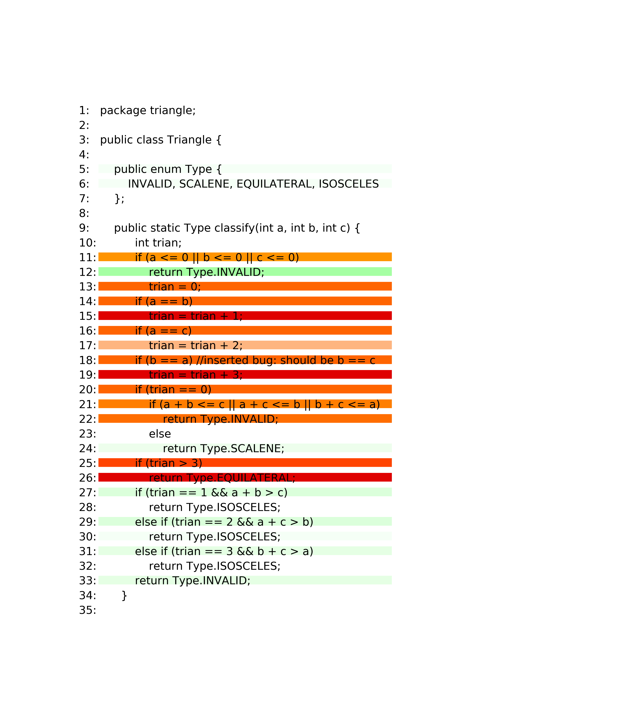
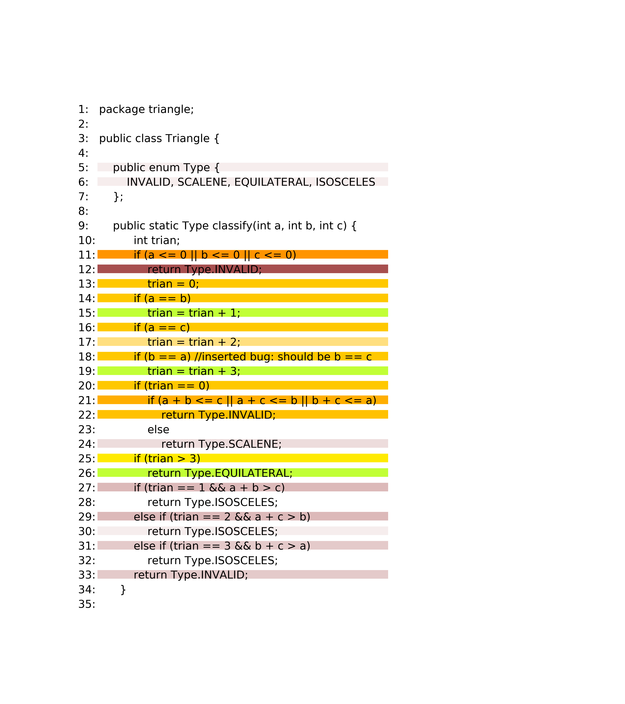
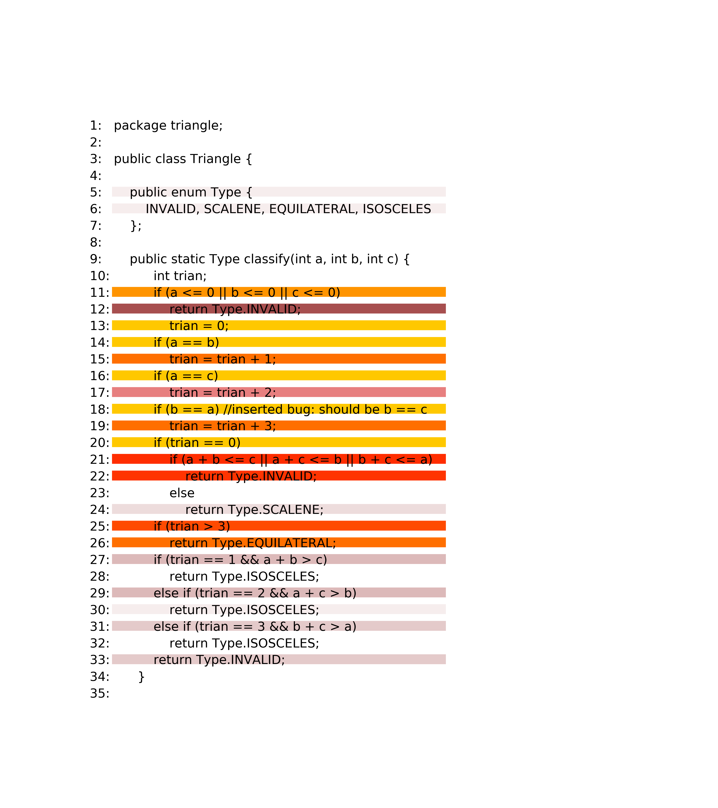
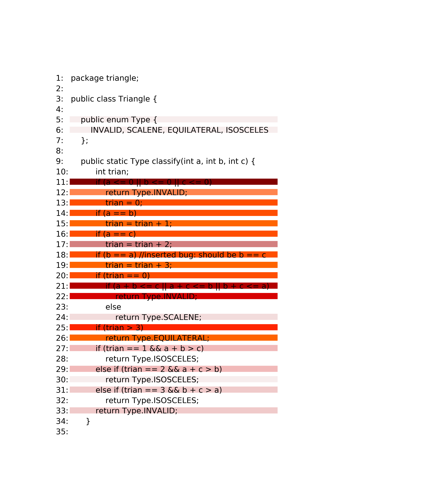

## Software Engineering Lab#6

#### 11510225 Yuxing Hu

---

## Tatantula

**Algorithm**

Tarantula algorithm is like the default algorithm for
the testing, the formula of tatantula is:

$$ Tarantula=\frac{a_{ep}}{a_{ep}+a_{ef}} $$

according to the lab slides. However, according to some
other materials I've read, the formula is corrected as:

$$ Tarantula=\frac{\frac{a_{ef}}{a_{ef}+a_{nf}}}
{\frac{a_{ef}}{a_{ef}+a_{nf}}+\frac{a_{ep}}{a_{ep}+a_{np}}} $$

**Statistics**

The suspiciousness and condidence of tarantula is
like:

| No. of line| Suspiciousness   |  Condidence  |
| --------   | ----- | -----  |
|1| -1.0| -1.0|
|2| -1.0| -1.0|
|3|-1.0|-1.0|
|4|-1.0|-1.0|
|5|1.0|0.034482758620689655|
|6|1.0|0.034482758620689655|
|7|-1.0|-1.0|
|8|-1.0|-1.0|
|9|-1.0|-1.0|
|10|-1.0|-1.0|
|11|0.5|1.0|
|12|1.0|0.3448275862068966|
|13|0.3958333333333333|1.0|
|14|0.3958333333333333|1.0|
|15|0.17142857142857143|0.5|
|16|0.3958333333333333|1.0|
|17|0.40816326530612246|0.25|
|18|0.3958333333333333|1.0|
|19|0.17142857142857143|0.5|
|20|0.3958333333333333|1.0|
|21|0.4528301886792453|0.5|
|22|0.40816326530612246|0.5|
|23|-1.0|-1.0|
|24|1.0|0.06896551724137931|
|25|0.32558139534883723|0.5|
|26|0.17142857142857143|0.5|
|27|1.0|0.13793103448275862|
|28|-1.0|-1.0|
|29|1.0|0.13793103448275862|
|30|1.0|0.034482758620689655|
|31|1.0|0.10344827586206896|
|32|-1.0|-1.0|
|33|1.0|0.10344827586206896|

**Plots**

**Analysis**

Tarantula is a popular fault localization technique based on the executable statement hit spectrum. It
uses the execution trace information in terms of how each test covers the executable statements, and the
corresponding execution result (success or failure) to compute the suspiciousness of each statement as
X/(X+Y), where X = (number of failed tests that execute the statement)/(total number of failed tests), and
Y = (number of successful tests that execute the statement)/(total number of successful tests). One
problem with Tarantula is that it does not distinguish the contribution of one failed test case from another,
or one successful test case from another. 

## Kulczynski

**Algorithm**

According to our slides, the formula is like:

$$ Kulczynski=\frac{a_{ef}}{a_{ep}+a_{ef}} $$

But in the paper I discovered, the formula is like:

$$ Kulczynski=\frac{a_{ef}}{a_{ep}+a_{nf}} $$

**Statistics**

| No. of line| Suspiciousness   |  Condidence  |
| --------   | ----- | -----  |
|1| -1.0| -1.0|
|2| -1.0| -1.0|
|3|-1.0|-1.0|
|4|-1.0|-1.0|
|5|0.0|0.034482758620689655|
|6|0.0|0.034482758620689655|
|7|-1.0|-1.0|
|8|-1.0|-1.0|
|9|-1.0|-1.0|
|10|-1.0|-1.0|
|11|0.5|1.0|
|12|0.0|0.3448275862068966|
|13|0.6041666666666666|1.0|
|14|0.6041666666666666|1.0|
|15|0.8285714285714286|0.5|
|16|0.6041666666666666|1.0|
|17|0.5918367346938775|0.25|
|18|0.6041666666666666|1.0|
|19|0.8285714285714286|0.5|
|20|0.6041666666666666|1.0|
|21|0.5471698113207547|0.5|
|22|0.5918367346938775|0.5|
|23|-1.0|-1.0|
|24|0.0|0.06896551724137931|
|25|0.6744186046511628|0.5|
|26|0.8285714285714286|0.5|
|27|0.0|0.13793103448275862|
|28|-1.0|-1.0|
|29|0.0|0.13793103448275862|
|30|0.0|0.034482758620689655|
|31|0.0|0.10344827586206896|
|32|-1.0|-1.0|
|33|0.0|0.10344827586206896|

**Plot**

**Analysis**

In contrast, although Kulczynski perform somewhat worse than these metrics
overall for large numbers of tests, they are more robust and our experiments suggest
they may be better metrics to use in practice (and for small qe and proportion of failed
tests Kulczynski2 is the better of the two). Several of the other metrics also perform
very well in some circumstances.

## Dstar2

**Algorithm**

$$ Dstar2=\frac{a_{ef}^{2}}{a_{ep}+a_{nf}} $$

**Statistics**

| No. of line| Suspiciousness   |  Condidence  |
| --------   | ----- | -----  |
|1| -1.0| -1.0|
|2| -1.0| -1.0|
|3|-1.0|-1.0|
|4|-1.0|-1.0|
|5|0.0|0.034482758620689655|
|6|0.0|0.034482758620689655|
|7|-1.0|-1.0|
|8|-1.0|-1.0|
|9|-1.0|-1.0|
|10|-1.0|-1.0|
|11|0.5|1.0|
|12|0.0|0.3448275862068966|
|13|0.6041666666666666|1.0|
|14|0.6041666666666666|1.0|
|15|0.4142857142857143|0.5|
|16|0.6041666666666666|1.0|
|17|0.14795918367346939|0.25|
|18|0.6041666666666666|1.0|
|19|0.4142857142857143|0.5|
|20|0.6041666666666666|1.0|
|21|0.27358490566037735|0.5|
|22|0.29591836734693877|0.5|
|23|-1.0|-1.0|
|24|0.0|0.06896551724137931|
|25|0.3372093023255814|0.5|
|26|0.4142857142857143|0.5|
|27|0.0|0.13793103448275862|
|28|-1.0|-1.0|
|29|0.0|0.13793103448275862|
|30|0.0|0.034482758620689655|
|31|0.0|0.10344827586206896|
|32|-1.0|-1.0|
|33|0.0|0.10344827586206896|

**Plot**

**Analysis**

Since D* is significantly more effective than Tarantula, D* is also expected to outperform the above techniques. In a way to optimize Tarantula is presented which selects a subset of available test cases (as opposed to the entire test set) to maximize the number of basic blocks covered.

## Wong2

**Algorithm**

$$ Wong2=a_{ef}-a_{ep} $$

**Statistics**

| No. of line| Suspiciousness   |  Condidence  |
| --------   | ----- | -----  |
|1| -1.0| -1.0|
|2| -1.0| -1.0|
|3|-1.0|-1.0|
|4|-1.0|-1.0|
|5|0.034482758620689655|0.034482758620689655|
|6|0.034482758620689655|0.034482758620689655|
|7|-1.0|-1.0|
|8|-1.0|-1.0|
|9|-1.0|-1.0|
|10|-1.0|-1.0|
|11|0.0|1.0|
|12|0.3448275862068966|0.3448275862068966|
|13|0.3448275862068966|1.0|
|14|0.3448275862068966|1.0|
|15|0.39655172413793105|0.5|
|16|0.3448275862068966|1.0|
|17|0.07758620689655171|0.25|
|18|0.3448275862068966|1.0|
|19|0.39655172413793105|0.5|
|20|0.3448275862068966|1.0|
|21|0.08620689655172414|0.5|
|22|0.15517241379310343|0.5|
|23|-1.0|-1.0|
|24|0.06896551724137931|0.06896551724137931|
|25|0.2586206896551724|0.5|
|26|0.39655172413793105|0.5|
|27|0.13793103448275862|0.13793103448275862|
|28|-1.0|-1.0|
|29|0.13793103448275862|0.13793103448275862|
|30|0.034482758620689655|0.034482758620689655|
|31|0.10344827586206896|0.10344827586206896|
|32|-1.0|-1.0|
|33|0.10344827586206896|0.10344827586206896|

**Plot**

**Analysis**

The reason why Wong2 behave somewhat
differently from the other metrics can be understood by considering the two conditions
for optimality. Recall metrics are optimal if they increase as anp increases when
anf = 0 and always have smaller values when anf > 0.