## Software Eningeering Lab#7 (Finished all 4)

#### 11510225 Yuxing Hu

### Assignmnet 1: Compare build manage tools of Java

Build manage tools usually are used for software building,
including compiling the source code into the binary code,
package the binary code, and deploy automatic testing.

Although nowadays we use IDE to compile and run our 
codes, when it comes to a industrial project, we still use
manage tools to construct our codes. Because an open
source project which using an IDE is likely to give 
commercial profit to the IDE company and if engineers
within same group using different IDE the communication
will became extremely hard. On the other side, using
building manage tools could allow us to run the code by
command line and promote production.

The managing tools can download the dependencies,
compile the source code into the assemble language and
then deploy the unit test into productive system. Historically
the automatic construction is based on makefiles, a file that
contains most of instructions, and different languages have
different construction tools. In Java, mostly we use Ant,
Maven and Gradle.

Ant was the first build tool released in 2000 and was easy to learn. Build scripts format was XML.
The core of Ant is wrote by Java, and it use XML as its
building script. So it allows us deploy and run no matter
what situation the coder is using. Ant is based on task 
chain, which means different tasks are defined by each
other, and therefore form a sequence. The shortcoming of 
Ant is that using XML to make script make the script 
clumsy . Ant itself do not give any guidance for project,
so each building script could be different. The developer
should become familiar with those code by themselves
according to different project. There is no management
tool provided within Ant ecosystem.

Maven was released in 2004. It has improved few of the problem of ANT. Maven continues using XML as the format to write build script, however, structure is diametrically different.The Most important addition, was the ability to download dependencies over the network(later on adopted by Ant through Ivy).
Based on those lacking fact of Ant, another build managing
tool called Maven was produced. Maven use standard
project layout and unified lifecycle to construct. The guideline
of Maven is convention before configuration, which means it
will decline the content that script made and really easy to
find suitable plug-in components. The disadvantage of 
Maven is that by using default construction and lifecycle is
to much limited and has many constraints. On the other
hand, making extensions by plugins is pretty troublesome.

Gradle was released in 2012. Google adopted Gradle as the default build tool for the Android OS. Gradle does not use XML. Instead, it had its own DSL based on Groovy (one of JVM languages). As a result, Gradle build scripts tend to be much shorter and clearer than those written for Ant or Maven.
Initially, Gradle used Apache Ivy for its dependency management. Later own it moved to its own native dependency resolution engine.
Gradle, however, has all the strengthens of Maven and Ant,
and it’s based on Groovy’s DSL, and provide statement-type
script language. It use standard project layout but has fully
configurative nature. It could be override by extensions and
provide any lifecycle the developer like. The user can also 
define the task by them self and run them separately or
define the dependencies of the tasks by the power of its
management tool. Gradle is compatible with Ant and it can
multiplex the Ant’s mission. There are several ways to
implement plugins and has a fully functional official extension
library. It also provide migration plan from Maven and Ant.
By it’s packing tool, it can be run on different platform
without any mistake.

Gradle can be used for many purposes - it's a much better
Swiss army knife than Ant - but it's specifically focused on multi-project builds.

First of all, Gradle is a dependency programming tool 
which also means it's a programming tool. With Gradle you
can execute any random task in your setup and Gradle will
make sure all declared dependencies are properly and 
timely executed. Your code can be spread across many 
directories in any kind of layout (tree, flat, scattered, ...).

Gradle has two distinct phases: evaluation and execution. Basically, during evaluation Gradle will look for and evaluate build scripts in the directories it is supposed to look. During execution Gradle will execute tasks which have been loaded during evaluation taking into account task inter-dependencies.
On top of these dependency programming features Gradle adds project and JAR dependency features by integration with Apache Ivy. As you know Ivy is a much more powerful and much less opinionated dependency management tool than say Maven.

Gradle detects dependencies between projects and between projects and JARs. Gradle works with Maven repositories (download and upload) like the iBiblio one or your own repositories but also supports and other kind of repository infrastructure you might have.

In multi-project builds Gradle is both adaptable and adapts to the build's structure and architecture. You don't have to adapt your structure or architecture to your build tool as would be required with Maven.
Gradle tries very hard not to get in your way, an effort Maven almost never makes. Convention is good yet so is flexibility. Gradle gives you many more features than Maven does but most importantly in many cases Gradle will offer you a painless transition path away from Maven.

So that's the reason why I use Gradle for management tool.

---

### Assignment 2: Complete the gradle tutorial

1. Install the gradle

 

2. Build the java code

 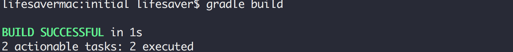

3. Change the code and then build

 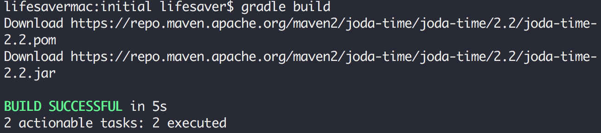

4. Build with gradle wrapper

 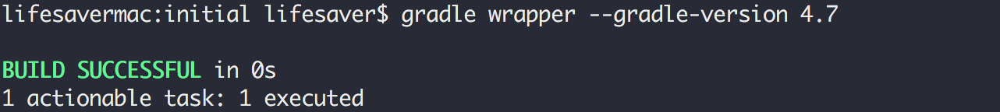

5. Run the wrapper script to perform the build task

 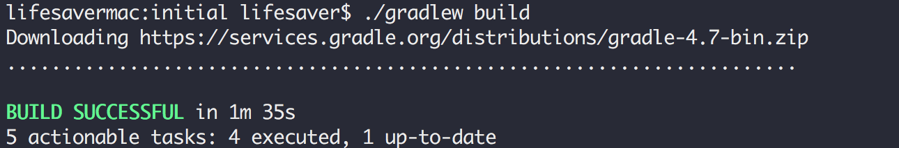

6. A quick peek for jar file
 
 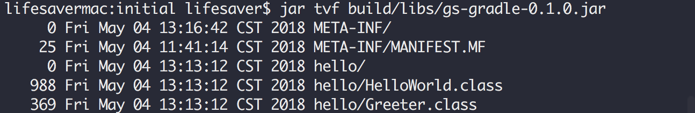

7. Run the app!

 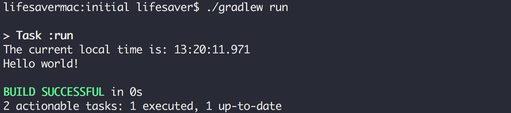

8. Show the file structure

 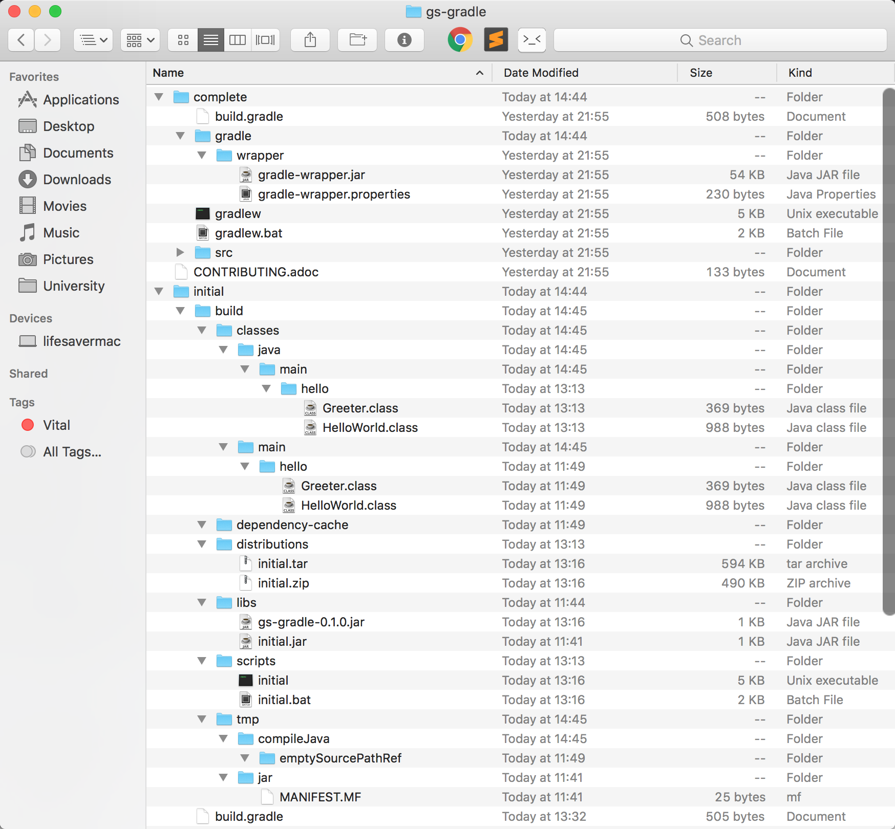
 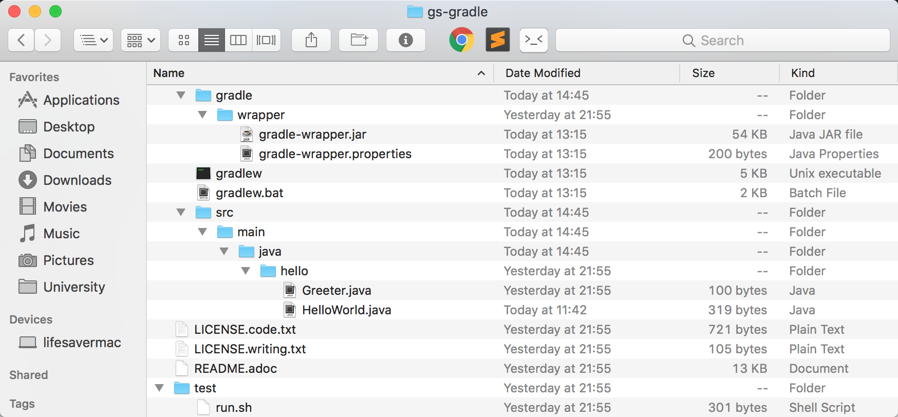

---

### Assignment 3: Deploy project on Travis-CI

Task 3 link: https://scans.gradle.com/s/ycc3motc6v2y4/performance/build

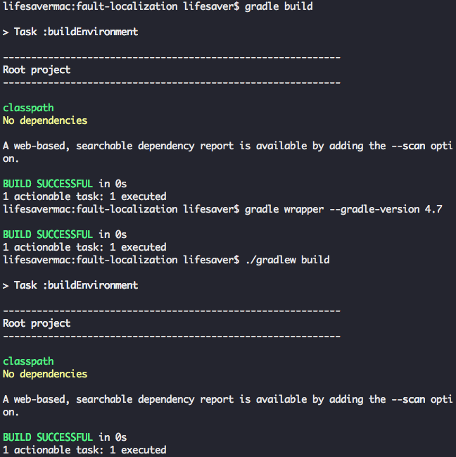

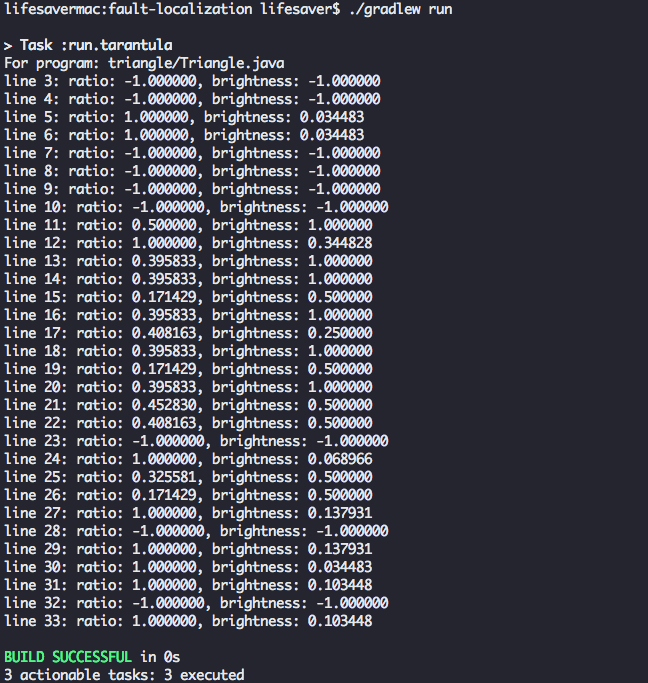

---

### Assignment 4: Deploy project on Travis-CI

Task 4 link: https://travis-ci.org/lifesaver0129/gs-gradle

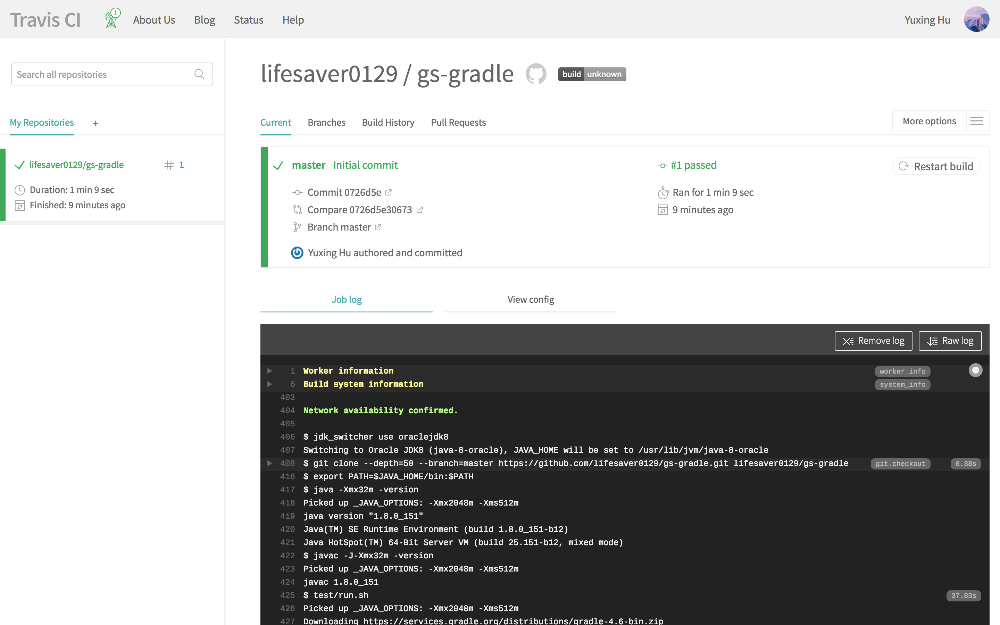

