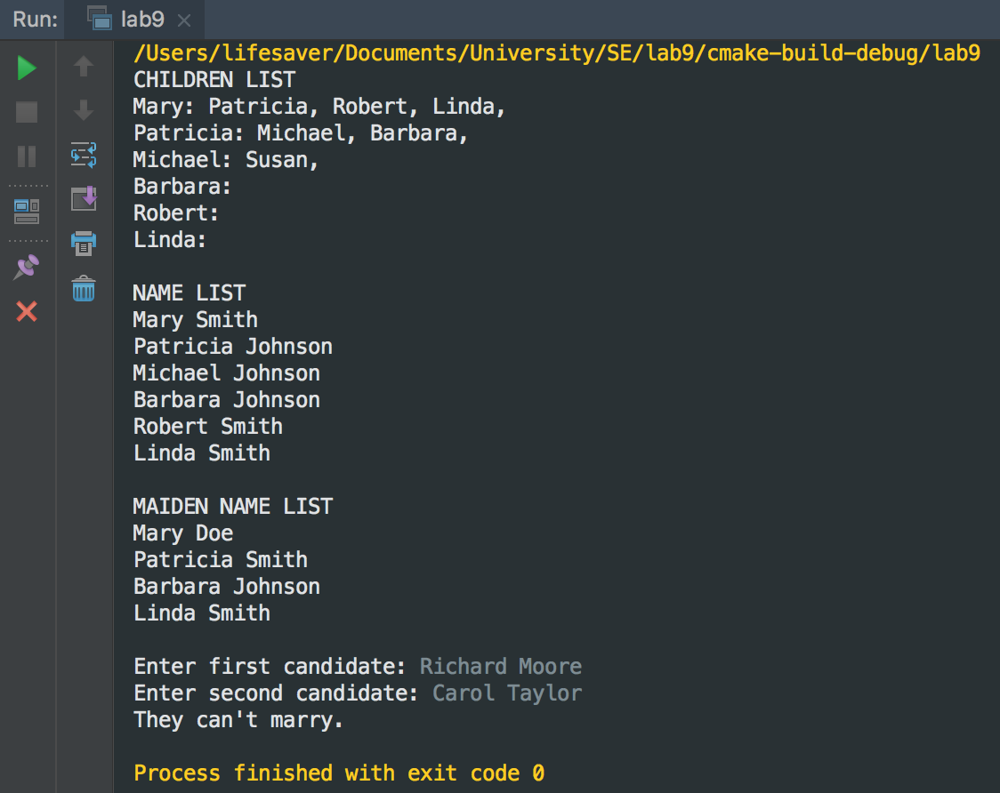

# Software Engineering Lab#9 Bonus

### 11510225 Yuxing Hu

---

## Complete Composite Visitor Genealogy Lab

**Stragety I've used**

This lab require us to manage two tasks, using composite and two variants of the visitor pattern. 

The maiden name task require us to print all the maiden name of all the ladies. Maiden name is the name of their fathers', except for those who don't setting the father name in. The stragety is pretty simple. First of all I write a MadenPrinter class which is the subclass of PersonVisitor, and override the visit method in the public area and make them editiable. For man, they don't have a maiden name so I just skipped them. For woman, the maiden name should be their father's so I check whether they have a father on the record, if so, print the name out as their maiden name; if not, using 'Doe' as their maiden name.

The Marriage advice require us to judge whether the two input users can be marriaged or not. The rule of checking whether they are able to marriage including:
    
 * It is illegal to marry oneself.
 * It is illegal to one's siblings, parents, children and aunts/uncles. 
 * It is illegal to marry a person who is already married.
 * First name, last name combination uniquely identifies a person in the genealogical tree.
 * The person must be inluded inside the family tree.

So I set a bool condition, if any rule is broke, the whole desicion will come into false. I use personExisted, personDuplicate, familyConstrain, siblingsConstrain to rule the input person. The MarriagePrinter class is also a subclass of PersonVisitor. For every inputing person, the woman and man should be tested by all rules. If the canMarry stays true, then the result is "They can marry". Otherwise the answer goes like "They can't marry".

**Screenshot of result**



**Lab's code**

```c++
#include <iostream>
#include <string>
#include <vector>

using std::cout; 
using std::cin; 
using std::endl;
using std::string;
using std::vector;

class Person {
public:
    Person(string firstName,
           Person *spouse,
           Person *father,
           Person *mother) :
            firstName_(firstName), spouse_(spouse),
            father_(father), mother_(mother) {}

    string getFirstName() { return firstName_; }

    Person *getSpouse() { return spouse_; }

    void setSpouse(Person *spouse) { spouse_ = spouse; }

    Person *getFather() { return father_; }

    Person *getMother() { return mother_; }

    virtual void accept(class PersonVisitor *)=0;

    virtual ~Person() {}

private:
    string firstName_;
    Person *spouse_;
    Person *father_;
    Person *mother_;
};

// composites

// man has a last name 
class Man : public Person {
public:
    Man(string lastName,
        string firstName,
        Person *spouse,
        Person *father, Person *mother) :
            lastName_(lastName),
            Person(firstName, spouse, father, mother) {}

    string getLastName() { return lastName_; }

    void accept(class PersonVisitor *visitor) override;

private:
    string lastName_;
};

// woman has a list of children
class Woman : public Person {
public:
    Woman(vector<Person *> children,
          string firstName,
          Person *spouse,
          Person *father, Person *mother) :
            children_(children),
            Person(firstName, spouse, father, mother) {}

    const vector<Person *> &getChildren() {
        return children_;
    }

    void setChildren(const vector<Person *> &children) {
        children_ = children;
    }

    void accept(class PersonVisitor *visitor) override;

private:
    vector<Person *> children_;
};

// abstract visitor
class PersonVisitor {
public:
    virtual void visit(Man *)=0;

    virtual void visit(Woman *)=0;

    virtual ~PersonVisitor() {}
};

// composite methods that define traversal
void Man::accept(PersonVisitor *visitor) {
    visitor->visit(this);
}

void Woman::accept(PersonVisitor *visitor) {
    // children traversal through mother only
    // father's children are not traversed so as not
    // to traverse them twice: for mother and father
    visitor->visit(this);
    // traversing descendants
    for (auto child : children_)
        child->accept(visitor);
}

// concrete visitors
// the last name for a man is stored in object
// the last name a woman is determined by her 
// spouse if she is married
// or by her father if she is not
class NamePrinter : public PersonVisitor {
public:
    void visit(Man *m) override {
        cout << m->getFirstName() << " "
             << m->getLastName() << endl;
    }

    void visit(Woman *w) override {
        cout << w->getFirstName() << " ";
        if (w->getSpouse() != nullptr)
            cout << static_cast<Man *>
            (w->getSpouse())->getLastName();
        else if (w->getFather() != nullptr)
            cout << static_cast<Man *>
            (w->getFather())->getLastName();
        else
            cout << "Doe";
        cout << endl;
    }
};


class ChildrenPrinter : public PersonVisitor {
public:
    void visit(Man *m) override {
        cout << m->getFirstName() << ": ";
        Woman *spouse = static_cast<Woman *>
        (m->getSpouse());
        if (spouse != nullptr)
            printNames(spouse->getChildren());
        cout << endl;
    }

    void visit(Woman *w) override {
        cout << w->getFirstName() << ": ";
        printNames(w->getChildren());
        cout << endl;
    }

private:
    void printNames(const vector<Person *> &children) {
        for (const auto c: children)
            cout << c->getFirstName() << ", ";
    }
};

class MaidenPrinter : public PersonVisitor {
public:
    void visit(Man *m) override {
    }

    void visit(Woman *w) override {
        cout << w->getFirstName() << " ";
        Man *father = static_cast<Man *>(w->getFather());
        if (w->getFather() != nullptr) {
            cout << static_cast<Man *>
            (w->getFather())->getLastName();
        } else {
            cout << "Doe";
        }
        cout << endl;
    }
};

class MarriagePrinter : public PersonVisitor {
public:
    MarriagePrinter(const string &p1f, const string &p1l,
     const string &p2f, const string &p2l) :
            canMarry(true), firstName1(p1f), firstName2(p2f),
            secondName1(p1l), secondName2(p2l) {
    }

    void visit(Man *m) override {
        Woman *spouse = static_cast<Woman *>(m->getSpouse());
        Man *father = static_cast<Man *>(m->getFather());
        Woman *mother = static_cast<Woman *>(m->getMother());

        if (personExisted(m->getFirstName(), m->getLastName())) {
            if (personDuplicate()) {
                canMarry = false;
            }
            if (familyConstrain()) {
                canMarry = false;
            }
            if (mother != nullptr) {
                string motherLastName = "Doe";
                if (mother->getFather() != nullptr) {
                    motherLastName = static_cast<Man *>
                    (mother->getFather())->getLastName();
                }
                if (siblingsConstrain(motherLastName)) {
                    canMarry = false;
                }
            }
        } else {
            canMarry = false;
        }
    }

    void visit(Woman *w) override {
        Man *spouse = static_cast<Man *>(w->getSpouse());
        Man *father = static_cast<Man *>(w->getFather());
        Woman *mother = static_cast<Woman *>(w->getMother());

        string lastName = "Doe";
        if (spouse != nullptr) {
            lastName = spouse->getLastName();
        } else if (father != nullptr) {
            lastName = father->getLastName();
        }

        if (personExisted(w->getFirstName(), lastName)) {
            if (spouse != nullptr) {
                canMarry = false;
            }
            if (personDuplicate()) {
                canMarry = false;
            }
            if (familyConstrain()) {
                canMarry = false;
            }
            if (mother != nullptr) {
                string motherLastName = "Doe";
                if (mother->getFather() != nullptr) {
                    motherLastName = static_cast<Man *>
                    (mother->getFather())->getLastName();
                }
                if (siblingsConstrain(motherLastName)) {
                    canMarry = false;
                }
            }
        } else {
            canMarry = false;
        }
    }

    void printResults() {
        if (canMarry) {
            cout << "They can marry." << endl;
        } else {
            cout << "They can't marry." << endl;
        }
    }

private:
    bool canMarry;

    string firstName1;
    string firstName2;
    string secondName1;
    string secondName2;

    bool personExisted(const string &fn, const string &ln) {
        if (fn == firstName1 && ln == secondName1) {
            return true;
        } else return fn == firstName2 && ln == secondName2;
    }

    bool personDuplicate() {
        return firstName1 == firstName2 && secondName1 == secondName2;
    }

    bool familyConstrain() {
        return secondName1 == secondName2;
    }

    bool siblingsConstrain(const string &familyName) {
        return familyName == secondName1 || familyName == secondName2;
    }
};

// demonstrating the operation
int main() {

    // setting up the genealogical tree
    // the tree is as follows
    //
    //
    //       James Smith  <--spouse-->   Mary
    //                                     |
    //                                    children -------------------------
    //                                     |              |                |
    //                                     |              |                |
    //      William Johnson <--spouse-> Patricia      Robert Smith       Linda
    //                                     |
    //                                    children------------
    //                                     |                 |
    //                                     |                 |
    //      Jennifer  <--spouse-->  Michael Johnson      Barbara
    //          |
    //        children
    //          |
    //          |
    //        Susan


    // first generation
    Man *js = new Man("Smith", "James",
                      nullptr, nullptr, nullptr);
    Woman *ms = new Woman({}, "Mary", nullptr, nullptr, nullptr);
    ms->setSpouse(js);
    js->setSpouse(ms);

    // second generation
    Woman *ps = new Woman({}, "Patricia",
                          nullptr, js, ms);
    Man *wj = new Man("Johnson", "William",
                      nullptr, nullptr, nullptr);
    ps->setSpouse(wj);
    wj->setSpouse(ps);

    vector<Person *> marysKids = {ps,
                                  new Man("Smith", "Robert", nullptr, js, ms),
                                  new Woman({}, "Linda", nullptr, js, ms)};
    ms->setChildren(marysKids);

    // third generation
    Man *mj = new Man("Johnson", "Michael", nullptr, wj, ps);
    vector<Person *> patsKids = {mj,
                                 new Woman({}, "Barbara", nullptr, wj, ps)};
    ps->setChildren(patsKids);

    Woman *jj = new Woman({}, "Jennifer", nullptr, nullptr, nullptr);
    vector<Person *> jensKids = {new Woman({}, "Susan", nullptr, mj, jj)};

    jj->setSpouse(mj);
    mj->setSpouse(jj);
    jj->setChildren(jensKids);


    // defining two visitors
    ChildrenPrinter *cp = new ChildrenPrinter;
    NamePrinter *np = new NamePrinter;
    MaidenPrinter *mp = new MaidenPrinter;


    // executing the traversal with the composite
    // and the specific visitor
    cout << "CHILDREN LIST\n";
    ms->accept(cp);

    cout << "\nNAME LIST\n";
    ms->accept(np);

    cout << "\nMAIDEN NAME LIST\n";
    ms->accept(mp);

    cout << endl;

    string p1f = "", p1l = "", p2f = "", p2l = "";
    cout << "Enter first candidate: ";
    cin >> p1f >> p1l;

    cout << "Enter second candidate: ";
    cin >> p2f >> p2l;

    MarriagePrinter *mc = new MarriagePrinter(p1f, p1l, p2f, p2l);

    ms->accept(mc);

    mc->printResults();
}
```
