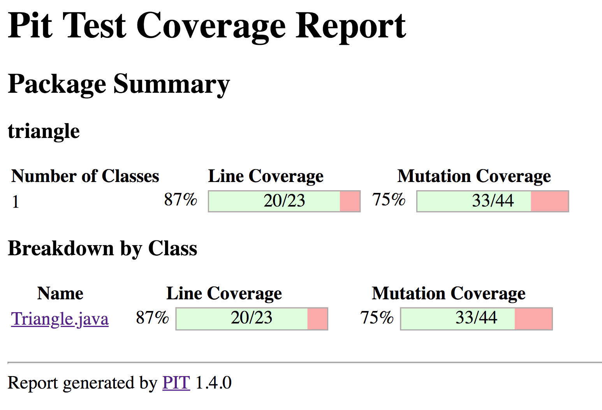
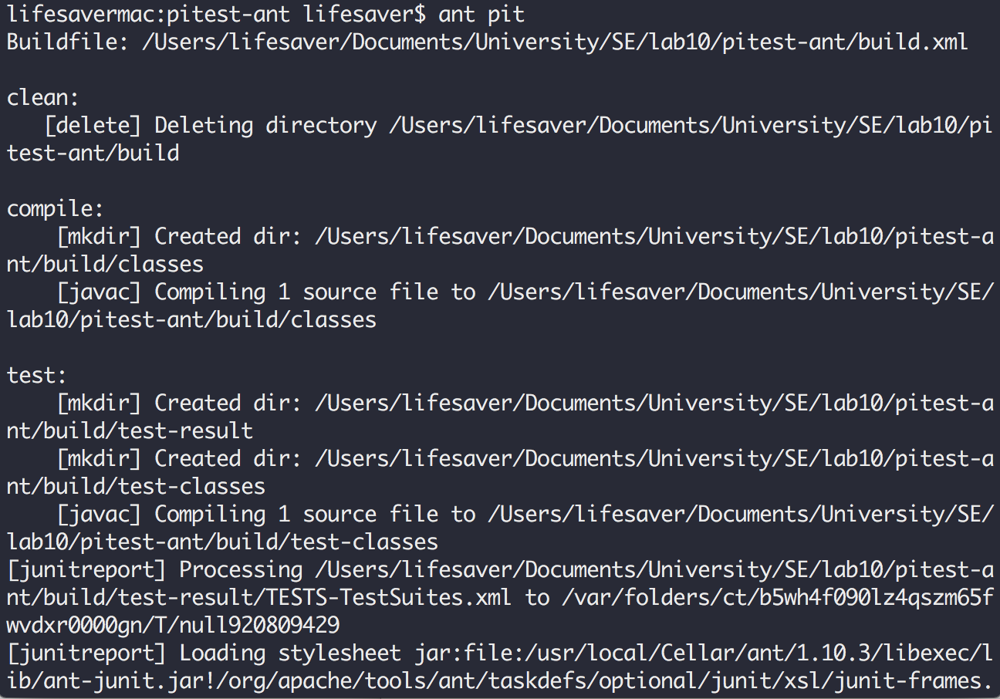
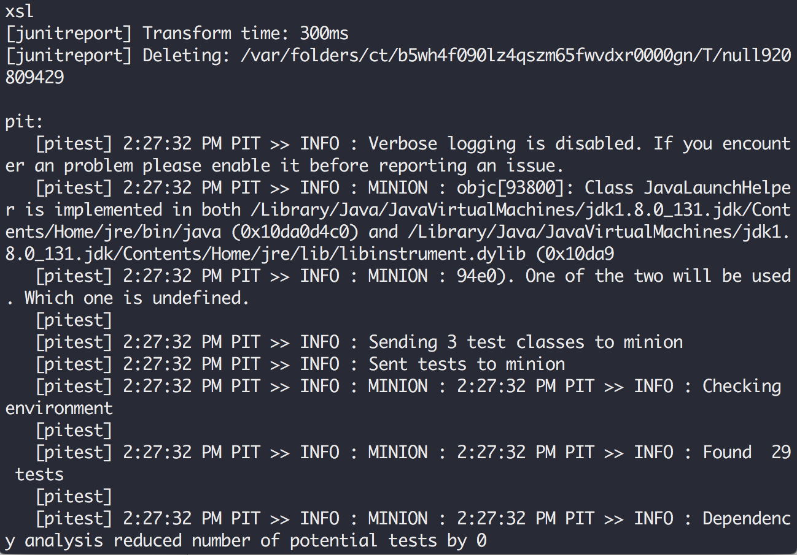
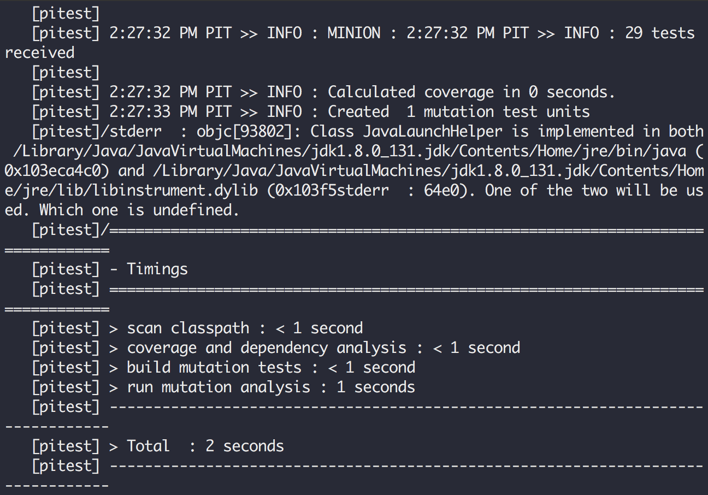
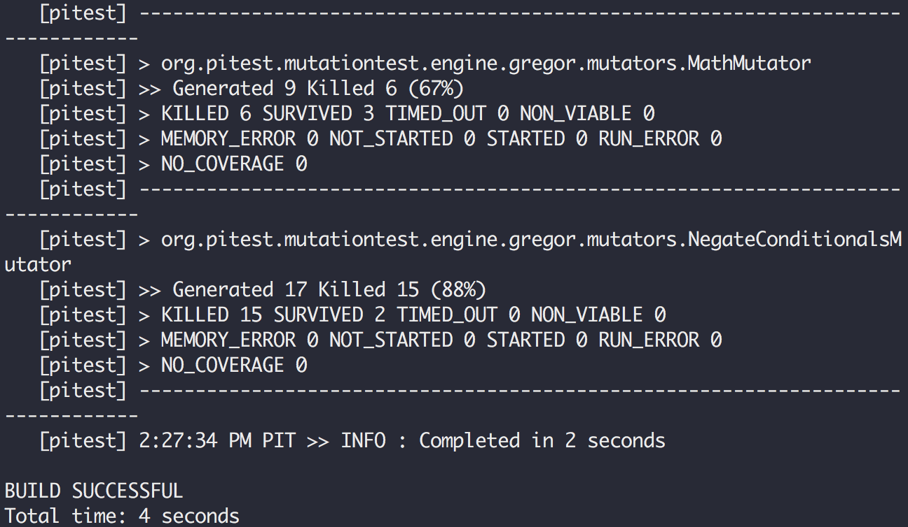

# Software Engineering Lab#10

### 11510225 Yuxing Hu

---

## Assignment 1: Mutation testing on original testsuite

**Original Files**

Atteched under the folder "pitestByAnt"

**Original PITEST Report**

Atteched under the folder "pitReports"



**Screenshots of Processing**










---

**Reports**

* Result Analysis

 The result of TestSuite.java is fully acceptable and 
 predictable. From the graph we can assume that the red
 part is for survial, and the green part is for killed.
 If the line gets one single survival, this line become
 red and only if all the test is killed will the line
 becomes green. The darker and lighter of the color is
 the result of percentage -- the ration of survial via
 number of all mutations of this line.

 Mutation testing is a testing technique used to improve
 the adequacy of tests and identify defects in code.
 The idea is to change the production code dynamically 
 and cause the tests to fail. Which means, good tests 
 shall fail.

 Back to this specfic task, the line coverage is 87%,
 which is 20/23, and the mutation coverage is 75%, which
 is 33/44. Clearly, our test sweeps across almost all the 
 execution paths, thus, the line coverage score is 
 almost 90%. In the other hand, the PITest library 
 introduced 44 mutants, 33 of them were killed – 
 Caused a fail – but 11 survived.

* Configuration on PIT

 Personally I use ant as the configuration platform which
 is recommeded by Pitest and fairly easy to deploy.
 After I install the ant software I need input all the lib
 into the pitest.path.

 ```html
 <path id="pitest.path">
    <pathelement location="lib/junit-4.12.jar" />
    <pathelement location="lib/hamcrest-core-1.3.jar" />
    <pathelement location="lib/pitest-1.4.0.jar" />
    <pathelement location="lib/pitest-entry-1.4.0.jar" />
    <pathelement location="lib/pitest-ant-1.4.0.jar" />
 </path>
 ```
 
 The following parameter including target of compile,
 clean, junit, javac and junitreport. And of course, define
 pit task and pit target as follows.

 ```html
  <taskdef name="pitest" classname="org.pitest.ant.PitestTask" classpathref="pit.path" />

  <target name="mutationCoverage">
    <pitest
        pitClasspath="pit.path"
        classPath="mutation.path"
        targetClasses="com.yourcodebase.*"
        targetTests="com.yourcodebase.*"
        reportDir="pathToWhereYouWantOutput"
        sourceDir="pathToYourSource"/>
 </target>
 ```

 After all these
 work are done, just simply type in:

 ```bash
 ant pit
 ```

 
