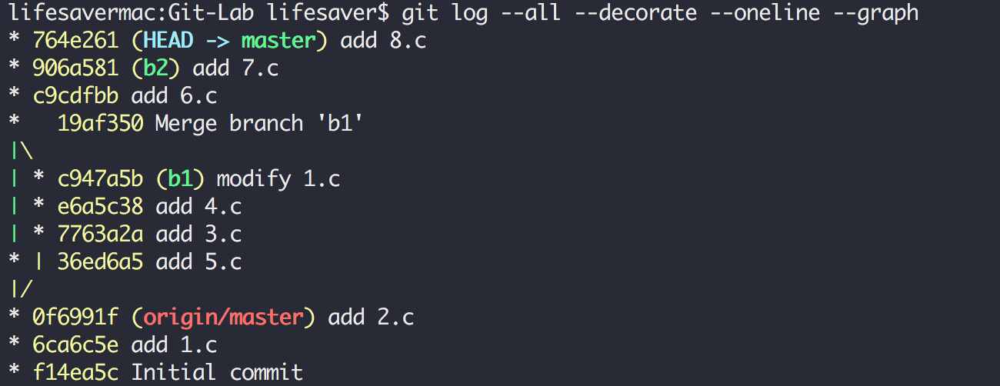

# Git-Lab

### 11510225 Yuxing Hu

## All my bash commands

```
$ git init
$ git add 1.c
$ git commit -m "add 1.c"
$ git add 2.c
$ git commit -m "add 2.c"
$ git branch b1
$ git checkout b1
$ git add 3.c
$ git commit -m "add 3.c"
$ git add 4.c
$ git commit -m "add 4.c"
$ git checkout master
$ git add 1.c
$ git commit -m "modify 1.c"
$ git add 5.c
$ git commit -m "add 5.c"
$ git merge b1
$ git branch b2
$ git checkout b2
$ git add 6.c
$ git commit -m "add 6.c"
$ git add 7.c
$ git commit -m "add 7.c"
$ git add 1.c
$ git commit -m "modify 1.c"
$ git rebase master
$ git rebase --skip
$ git checkout master
$ git merge b2
$ git add 8.c
$ git commit -m "add 8.c"
```

## git log result

```bash
commit 764e2616be2733fdb6c9b2afa552839eed12f135 (HEAD -> master)
Author: Yuxing Hu <huyuxing413@vip.qq.com>
Date:   Mon May 28 10:59:57 2018 +0800

    add 8.c

commit 906a5814ff639dfe61d7c93d1ab3ce142a5999ff (b2)
Author: Yuxing Hu <huyuxing413@vip.qq.com>
Date:   Mon May 28 10:47:36 2018 +0800

    add 7.c

commit c9cdfbb3f4415febcf42178176365d81d74e30b9
Author: Yuxing Hu <huyuxing413@vip.qq.com>
Date:   Mon May 28 10:46:08 2018 +0800

    add 6.c

commit 19af35032b969dfa806a4d462c870a68f35df604
Merge: 36ed6a5 c947a5b
Author: Yuxing Hu <huyuxing413@vip.qq.com>
Date:   Mon May 28 10:52:16 2018 +0800

    Merge branch 'b1'

    Merge b1 to master.

commit 36ed6a58b93baca8cb9306a6069bf8ba57ebfd24
Author: Yuxing Hu <huyuxing413@vip.qq.com>
Date:   Mon May 28 10:45:22 2018 +0800

    add 5.c

commit c947a5b8e04b1c4abffb1e4964551c8cc9cca250 (b1)
Author: Yuxing Hu <huyuxing413@vip.qq.com>
Date:   Mon May 28 10:43:20 2018 +0800

    modify 1.c

commit e6a5c38b74c2e458cfbd27af7c10d96c5eac98da
Author: Yuxing Hu <huyuxing413@vip.qq.com>
Date:   Mon May 28 10:41:38 2018 +0800

    add 4.c

commit 7763a2ae92fa8309aa6ae8747eb3c65f723795e5
Author: Yuxing Hu <huyuxing413@vip.qq.com>
Date:   Mon May 28 10:40:53 2018 +0800

    add 3.c

commit 0f6991f785f78ef69332cd5fae5163b1bba65b32 (origin/master)
Author: Yuxing Hu <huyuxing413@vip.qq.com>
Date:   Mon May 28 10:38:26 2018 +0800

    add 2.c

commit 6ca6c5e2d4ed6ecf86ec61fdd35cb0b7b09a0565
Author: Yuxing Hu <huyuxing413@vip.qq.com>
Date:   Mon May 28 10:37:09 2018 +0800

    add 1.c

commit f14ea5c1a2a1a764ac0be91cde52e6dd0945113e
Author: Yuxing Hu <huyuxing413@vip.qq.com>
Date:   Mon May 28 10:34:01 2018 +0800

    Initial commit
```

## Screenshot



## Comments

> How do you solve conflicts on second merge?

The conflict actually happens when it comes to rebase, and there are 3 ways of dealing with it:

* We can run git rebase --abort to completely undo the rebase. Git will return us to our branch's state as it was before git rebase was called.
* We can run git rebase --skip to completely skip the commit. That means that none of the changes introduced by the problematic commit will be included. It is very rare that we would choose this option.
* We can fix the conflict.

So after dealing with this rebase conflict, there will not be any conflict when it comes to merge.

