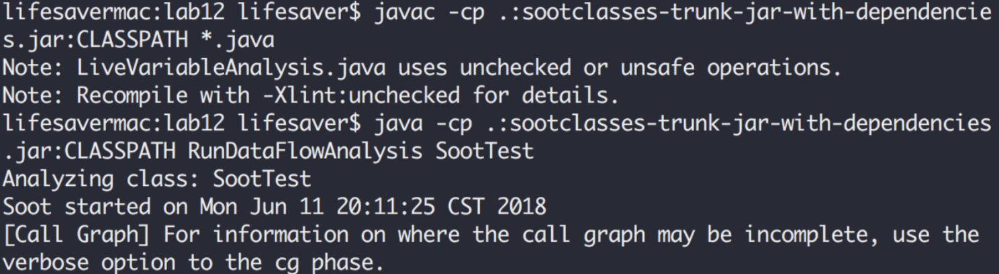
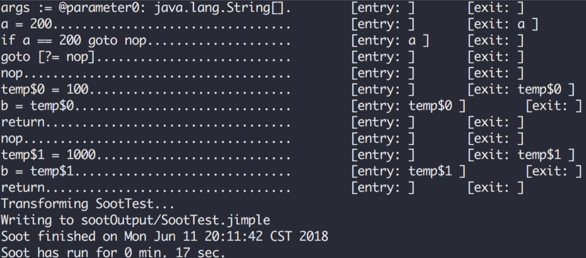

# Software Engineering Lab #12

### 11510225 Yuxing Hu

---

## Implement my version of Soot assignmnet

### Commands

1. Build the whole project

`javac -cp .:sootclasses-trunk-jar-with-dependencies.jar:CLASSPATH *.java`

2. Run the soot package

`java .:sootclasses-trunk-jar-with-dependencies.jar:CLASSPATH RunDataFlowAnalysis SootTest`

### Screenshots






### Output file: SootTest.jimple

```java

public class SootTest extends java.lang.Object{ 
    public static void main(java.lang.String[]){
        java.lang.String[] args;
        args := @parameter0: java.lang.String[]; 
        goto label1;
        label1:
            return; 
    }

    public void <init>(){ 
        SootTest this;
        this := @this: SootTest;
        specialinvoke this.<java.lang.Object: void <init>()>();
        return; 
    }
}
```